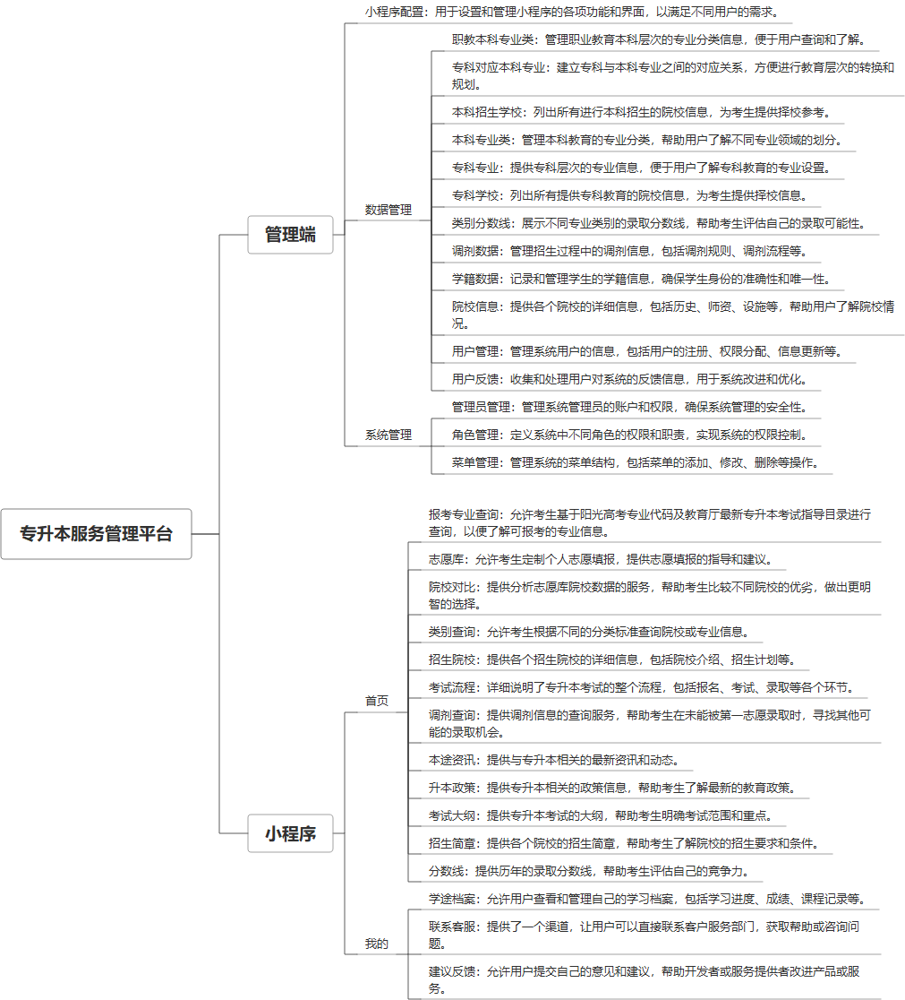

 

    
 

公司拥有上百套具有自主知识产权的软件系统，详情请查看码云首页或公司官网

 
<h1>专升本业务管理系统</h1>

<a href="https://www.haishi.net.cn/">公司官网</a> ｜ <a href="https://www.haishi.net.cn/">在线体验</a>

 

## 系统介绍

专升本业务管理系统是一个综合性的在线平台，旨在为专科生提供本科升学的全面信息和服务。系统包括考试倒计时、轮播图展示、首页功能条和文章等基本功能，提供报考流程的详细指南、专科与本科专业的对应关系、以及本科招生院校的信息。此外，系统还涵盖了专科专业类别、具体专业以及专科院校的详细介绍。为了帮助学生更好地了解升学机会，系统提供了类别分数线、调剂和学籍数据等关键信息。同时，还设有院校信息查询和用户管理功能，以及一个用户反馈模块，以优化服务并适应用户的具体需求。这个系统是帮助专科生顺利升入本科的重要工具，通过集成和提供关键信息与服务，支持用户做出更加明智的教育选择。
本项目名称为专升本服务管理平台，旨在为用户提供全面的专升本信息服务。该平台主要包括用户管理、数据管理、系统管理等模块，支持用户进行报考专业查询、院校对比、志愿库管理等功能。系统适用于学生、院校及相关管理人员，能够有效提升信息查询效率，优化用户体验。
        

## 系统功能介绍

### 系统包含终端说明

管理端（WEB）、用户端（微信小程序）

| 序号 | 模块 | 模块说明 |
| --- | --- | --- |
| 1 | JY-ZSB-JYGL-SERVER-MP | 小程序 |
| 2 | JY-ZSB-JYGL-SERVER | 服务端 |
| 3 | JY-ZSB-JYGL-MANAGE | 管理端 |

### 系统功能结构

### 系统功能说明

系统功能包括：1. 用户管理：管理用户信息和反馈；2. 数据管理：管理职教本科专业、专科对应本科专业、招生学校等数据；3. 小程序端功能：提供首页、报考专业查询、志愿库、院校对比等功能。

## 系统主要界面

## 系统技术说明

### 代码模块说明

| 序号 | 目录 | 目录说明 |
| --- | --- | --- |
| 1 | JY-ZSB-JYGL-SERVER/sc-feign | -- |
| 2 | JY-ZSB-JYGL-SERVER/sc-common | -- |
| 3 | JY-ZSB-JYGL-SERVER/sc-server | -- |

### 系统技术选型

#### 开发语言/框架

JAVA（JDK1.8）
前端框架：VUE2
前端框架：uni-app
框架：SpringBoot2.x
系统结构：单体应用

#### 服务中间件

Nginx
Tomcat

#### 数据库

MySQL（5.7+）
Redis

#### 其他说明

无

## 系统演示/商用

请扫码添加客服微信获取演示地址和系统详细资料。

如果您想基于专升本业务管理系统进行商业化交付或定制开发服务，我们提供有偿的技术服务支持，合作模式不限，欢迎沟通！

公司官网地址： <a href="https://www.haishi.net.cn/">https://www.haishi.net.cn</a>

联系客服获取专业回答。

## 使用须知

1、 本项目商用必须获得版权所有者的授权。

2、 未经允许本项目代码不允许二次出售。

